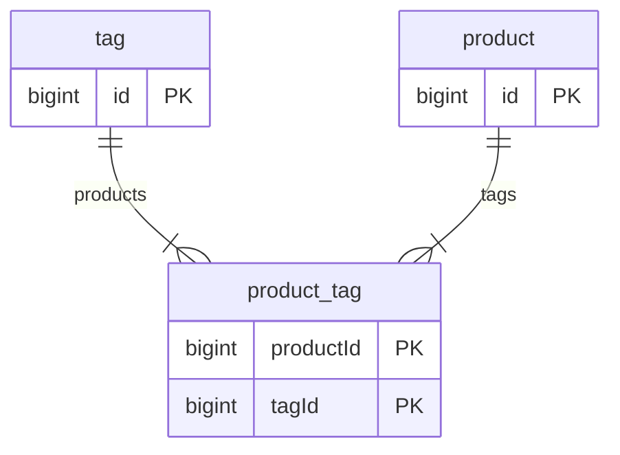

# TypeORM ERD

> Generating ERD for TypeORM data sources

- [TypeORM ERD](#typeorm-erd)
  - [Usage](#usage)
    - [Output](#output)
  - [TODO](#todo)
  - [Shoulders](#shoulders)

## Usage

Currently programmatic usage is the only supported usage method:

```bash
yarn add typeorm-erd
```

```ts
// src/data-source.ts
import { MermaidErd } from "typeorm-erd";

const main = async () => {
  const erd = new MermaidErd(AppDataSource);
  await erd.initialize();
  const erdText = await erd.render();

  console.info(erdText);
};

main();
```

### Output



## TODO

- [ ] When relation is nullable use `o{` relation to show zero or more
- [ ] Publish to NPM to allow usage in other modules

## Shoulders

Based on [https://github.com/eugene-manuilov/typeorm-uml](https://github.com/eugene-manuilov/typeorm-uml) but with separation of concerns between EntityTreeConstruction and output format.
