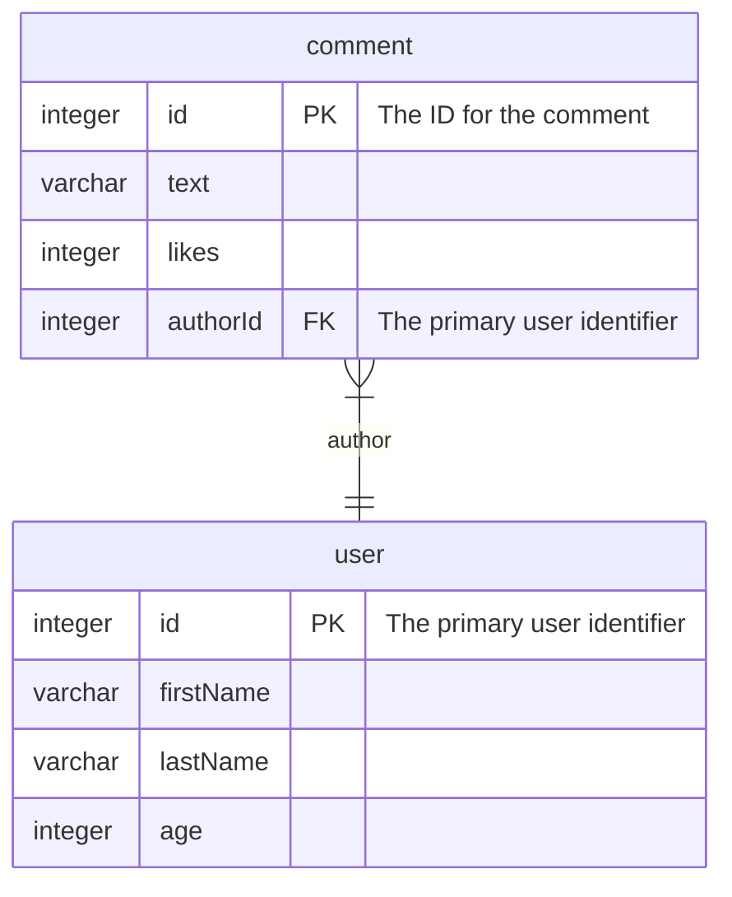
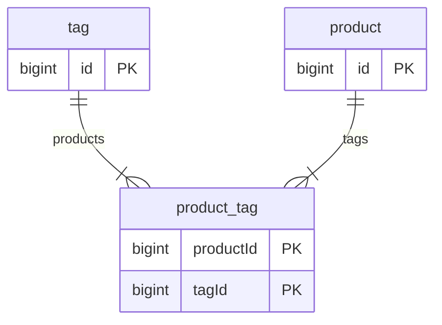
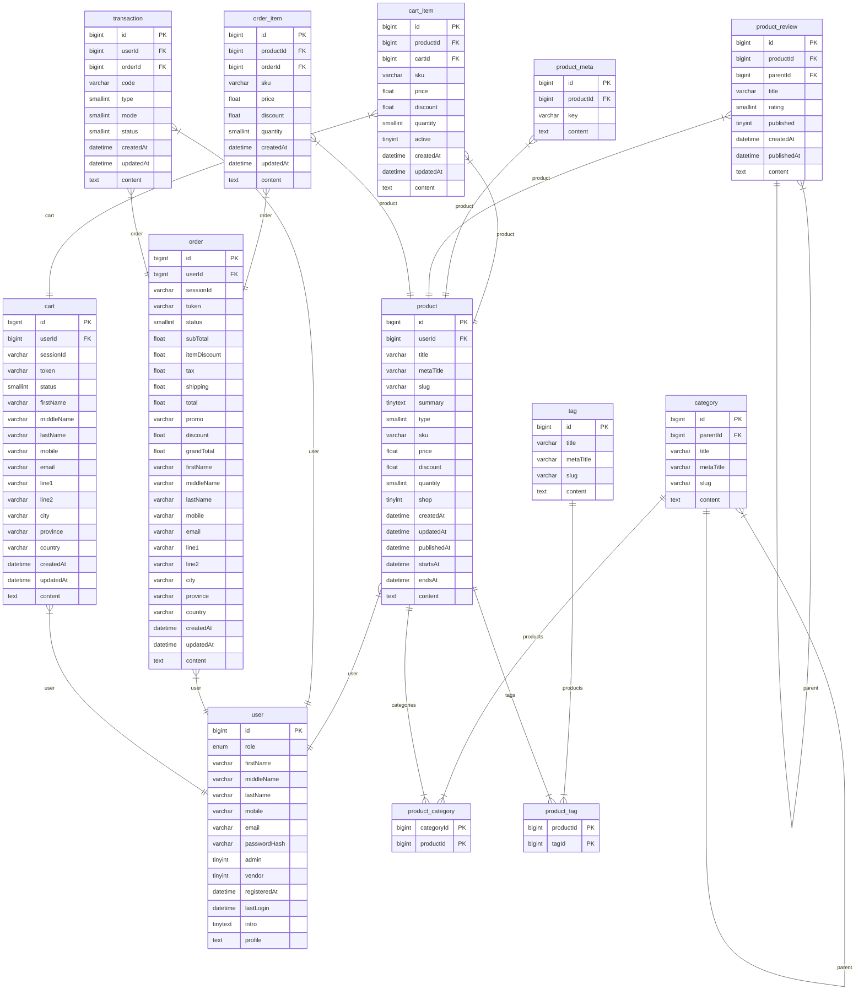

## Basic

```mermaid
erDiagram
  user {
    integer id PK "The primary user identifier"
    varchar firstName
    varchar lastName
    integer age
  }
  comment {
    integer id PK "The ID for the comment"
    varchar text
    integer likes
    integer authorId FK "The primary user identifier"
  }
  comment }|--|| user: author
```

## Join Table

```mermaid
erDiagram
  tag {
    bigint id PK
  }
  product {
    bigint id PK
  }
  product_tag {
    bigint productId PK
    bigint tagId PK
  }
  tag ||--|{ product_tag: products
  product ||--|{ product_tag: tags
```

## Carts

```mermaid
erDiagram
  cart_item {
    bigint id PK
    bigint productId FK
    bigint cartId FK
    varchar sku
    float price
    float discount
    smallint quantity
    tinyint active
    datetime createdAt
    datetime updatedAt
    text content
  }
  category {
    bigint id PK
    bigint parentId FK
    varchar title
    varchar metaTitle
    varchar slug
    text content
  }
  product_meta {
    bigint id PK
    bigint productId FK
    varchar key
    text content
  }
  product_review {
    bigint id PK
    bigint productId FK
    bigint parentId FK
    varchar title
    smallint rating
    tinyint published
    datetime createdAt
    datetime publishedAt
    text content
  }
  tag {
    bigint id PK
    varchar title
    varchar metaTitle
    varchar slug
    text content
  }
  product {
    bigint id PK
    bigint userId FK
    varchar title
    varchar metaTitle
    varchar slug
    tinytext summary
    smallint type
    varchar sku
    float price
    float discount
    smallint quantity
    tinyint shop
    datetime createdAt
    datetime updatedAt
    datetime publishedAt
    datetime startsAt
    datetime endsAt
    text content
  }
  order_item {
    bigint id PK
    bigint productId FK
    bigint orderId FK
    varchar sku
    float price
    float discount
    smallint quantity
    datetime createdAt
    datetime updatedAt
    text content
  }
  transaction {
    bigint id PK
    bigint userId FK
    bigint orderId FK
    varchar code
    smallint type
    smallint mode
    smallint status
    datetime createdAt
    datetime updatedAt
    text content
  }
  order {
    bigint id PK
    bigint userId FK
    varchar sessionId
    varchar token
    smallint status
    float subTotal
    float itemDiscount
    float tax
    float shipping
    float total
    varchar promo
    float discount
    float grandTotal
    varchar firstName
    varchar middleName
    varchar lastName
    varchar mobile
    varchar email
    varchar line1
    varchar line2
    varchar city
    varchar province
    varchar country
    datetime createdAt
    datetime updatedAt
    text content
  }
  user {
    bigint id PK
    enum role
    varchar firstName
    varchar middleName
    varchar lastName
    varchar mobile
    varchar email
    varchar passwordHash
    tinyint admin
    tinyint vendor
    datetime registeredAt
    datetime lastLogin
    tinytext intro
    text profile
  }
  cart {
    bigint id PK
    bigint userId FK
    varchar sessionId
    varchar token
    smallint status
    varchar firstName
    varchar middleName
    varchar lastName
    varchar mobile
    varchar email
    varchar line1
    varchar line2
    varchar city
    varchar province
    varchar country
    datetime createdAt
    datetime updatedAt
    text content
  }
  product_category {
    bigint categoryId PK
    bigint productId PK
  }
  product_tag {
    bigint productId PK
    bigint tagId PK
  }
  cart_item }|--|| cart: cart
  cart_item }|--|| product: product
  category }|--|| category: parent
  category ||--|{ product_category: products
  product_meta }|--|| product: product
  product_review }|--|| product_review: parent
  product_review }|--|| product: product
  tag ||--|{ product_tag: products
  product }|--|| user: user
  product ||--|{ product_category: categories
  product ||--|{ product_tag: tags
  order_item }|--|| order: order
  order_item }|--|| product: product
  transaction }|--|| order: order
  transaction }|--|| user: user
  order }|--|| user: user
  cart }|--|| user: user
```
